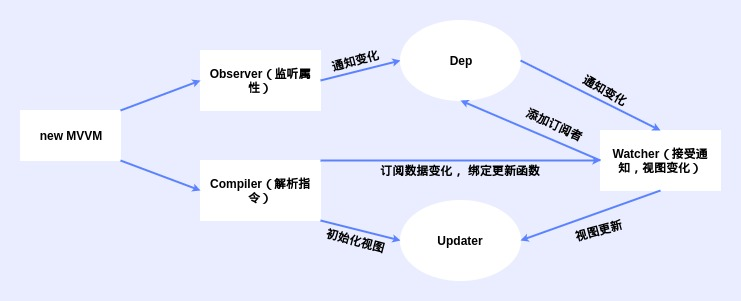

# MVVM框架

## 框架概念



如图所示，一个MVVM框架涉及6个类

1. MVVM - 框架构造函数
2. Observer - 区分数据类型，实现数据相应化
3. Compiler - 编译模板，初始化视图， 收集依赖（更新函数，watcher创建）
4. Watcher - 接收Observer的数据变化，执行更新函数Updater
5. Dep - 是Observer与Watcher间的中间件，管理多个Watcher，将接收到的属性key找到其对应的多个Watcher， 并通知他们更改
6. Updater - 处理初始化时的视图展示和Watcher的更新通知

## MVVM与Observer的响应式处理

### 通用方法

```js
// 全局通用方法
// 定义响应数据
function defineReactive(obj, key, val) {
    // 迭代循环更改响应式
    observe(val)
    Object.defineProperty(obj, key, {
        get() {
            console.log(`get ${key}:${val}`)
            return val
        },
        set(newVal) {
            if (newVal !== val) {
                console.log(`set ${key}:${newVal}`)
                // 如果传入的newVal依然是obj，需要做响应化处理
                observe(newVal)
                val = newVal
            }
        }
    })
}

// 数据响应化
function observe(obj) {
    // 只针对对象
    if (typeof obj !== 'object' || obj == null) {
        return
    }
    new Observer(obj)
}
```

### MVVM

```js
/// MVVM
class MVVM {
    constructor(options) {
        // 1.保存配置
        this.$options = options
        this.$data = options.data
        // this.$el = document.querySelector(options.$el)

        // 2.数据相应化
        observe(this.$data)

        // 3.数据代理
        this.proxy(this, '$data')
    }
    // 数据代理
    proxy(vm, name) {
        Object.keys(vm[name]).forEach(key => {
            Object.defineProperty(vm, key, {
                get() {
                    return vm[name][key]
                },
                set(value) {
                    vm[name][key] = value
                }
            })
        })
    }
}
```

### Observer

```js
/// Observer
class Observer {
    constructor(value) {
        this.value = value
        this.walk(this.value)
    }

    // 遍历当前数据各所有熟悉分别响应化
    walk(obj) {
        Object.keys(obj).forEach(key => {
            defineReactive(obj, key, obj[key])
        })
    }
}
```

## Complier编译器处理

 


### 基本流程

```js
// Compiler
class Compiler {
    constructor(el, vm) {
        // 处理属性
        this.$vm = vm
        this.$el = document.querySelector(el)

        // 处理编译元素
        if (this.$el) {
            this.compile(this.$el)
        }
    }

    // 元素编译处理
    compile(el) {
        const childNodes = el.childNodes
        // 1. 循环处理子节点
        Array.from(childNodes).forEach(node => {
            // 1. 判断是节点还是文本
            if (this.isElement(node)) {
                console.log('元素编译' + node.nodeName)
                this.compileElement(node)

            } else if (this.isInterpolation(node)) {
                console.log('差值编译' + node.textContent)
                this.compileText(node)
            }
            // 2. 若当前节点有子节点，则继续迭代遍历
            this.compile(node)
        })
    }

    /// 元素判断
    // 是否为节点元素
    isElement(el) {
        return el.nodeType == 1
    }
    // 是否为插值文本
    isInterpolation(el) {
        return el.nodeType == 3 && /\{\{(.*)\}\}/.test(el.textContent)
    }

    // ...
}
```

### 元素编译

```js
/// 编译处理
// 元素编译
compileElement(node) {
    let nodeAttrs = node.attributes
    Array.from(nodeAttrs).forEach(attr => {
        let attrName = attr.name
        let exp = attr.value
        // 指令处理
        if (this.isDirective(attrName)) {
            let dir = attrName.substring(2);
            this[dir] && this[dir](node, exp);
        }
        // 事件处理
        if (this.isEvent(attrName)) {
            // 取名称
            let dir = attrName.substring(1);
            // 事件监听
            this.eventHandler(node, exp, dir)
        }
    });
}

/// 属性判断
// 是否为指令z-
isDirective(attr) {
    return attr.indexOf("z-") == 0
}
// 是否为事件@
isEvent(dir) {
    return dir.indexOf("@") == 0
}

/// 指令处理
// v-text
text(el, exp) {
    el.textContent = this.$vm[exp]
}
// v-html
html(el, exp) {
    el.innerHTML = this.$vm[exp]
}

/// 事件处理
eventHandler(node, exp, dir) {
    const fn = this.$vm.$options.methods && this.$vm.$options.methods[exp]
    // 注意bind，将作用域锁定在vue实例中
    node.addEventListener(dir, fn.bind(this.$vm))
}
```

### 插值编译

```js
/// 编译处理
// 插值编译
compileText(node) {
    console.log(RegExp.$1);
    node.textContent = this.$vm[RegExp.$1];
}
```

## Watcher与Dep处理

视图中会用到data中某key, 这称为依赖。同一个key可能出现多次, 每次都需要收集出来用一个
Watcher来维护它们, 此过程称为依赖收集。

多个Watcher需要一个Dep来管理, 需要更新时由Dep统一通知。


### 思路

1. defineReactive时为每一个key创建一个Dep实例
2. 编译时增加update方法，用于初始化视图时对被使用的key创建Watcher，并添加更新函数用于后续数据更新
3. key的getter方法中将Watcher添加到key对应的Dep中
4. setter触发时, 便可通过对应Dep通知其管理所有Watcher更新

### Watcher

保存更新函数，值发生变化调用更新函数

```js
/// Wacther
class Watcher {
    constructor(vm, key, updateFn) {
        // 赋值
        this.vm = vm
        this.key = key
        this.updateFn = updateFn

        // Dep.target静态属性上设置为当前watcher实例
        Dep.target = this
        this.vm[this.key] // 读取属性名为key的属性，触发其getter用于添加watcher
        Dep.target = null // 收集完就置空
    }

    update() {
        this.updateFn.call(this.vm, this.vm[this.key])
    }
}
```

### Dep

依赖，管理某个key相关所有Watcher实例

```js
/// Dep
class Dep {
    constructor() {
        this.deps = []
    }
    // 添加watcher
    addDep(watcher) {
        this.deps.push(watcher)
    }
    // 通知包含的所有watcher更新
    notify() {
        this.deps.forEach(watcher => watcher.update());
    }
}
```

### 动态更新处理

defineReactive时为每一个key创建一个Dep实例，并在get与set上添加watcher和触发更新

```js
// 定义响应数据
function defineReactive(obj, key, val) {
    // 按照key创建Dep
    const dep = new Dep()

    Object.defineProperty(obj, key, {
        get() {
            // dep处理watcher添加
            Dep.target && dep.addDep(Dep.target);
            console.log(`get ${key}:${val}`)
            return val
        },
        set(newVal) {
            if (newVal !== val) {
                console.log(`set ${key}:${newVal}`)
                observe(newVal)
                val = newVal

                // dep通知数据更新
                dep.notify()
            }
        }
    })
}
```

Compiler增加update函数用于初始化编译的统一入口，并在首次编译时创建元素对应的Watcher

```js
   /// 编译处理
   // 元素编译
   compileElement(node) {
       let nodeAttrs = node.attributes
       Array.from(nodeAttrs).forEach(attr => {
           let attrName = attr.name
           let exp = attr.value
           if (this.isDirective(attrName)) {
               let dir = attrName.substring(2);
               this[dir] && this[dir](node, exp);
           }
       });
   }
   // 插值编译
   compileText(node) {
       this.update(node, RegExp.$1, 'text')
   }
   // 更新函数
   // 1.初始化
   // 2.创建Watcher实例
   update(node, exp, dir) {
       // 初始化
       // 指令对应更新函数xxUpdater
       const fn = this[dir + 'Updater']
       fn && fn(node, this.$vm[exp])

       // 更新处理，封装一个更新函数，可以更新对应dom元素
       new Watcher(this.$vm, exp, function(val) {
           fn && fn(node, val)
       })
   }

   /// 指令处理
   // v-text
   textUpdater(node, value) {
       node.textContent = value
   }
   // v-html
   htmlUpdater(node, value) {
       node.innerHTML = value
   }
   // k-text
   text(node, exp) {
       this.update(node, exp, 'text')
   }

   // k-html
   html(node, exp) {
       this.update(node, exp, 'html')
   }
```
