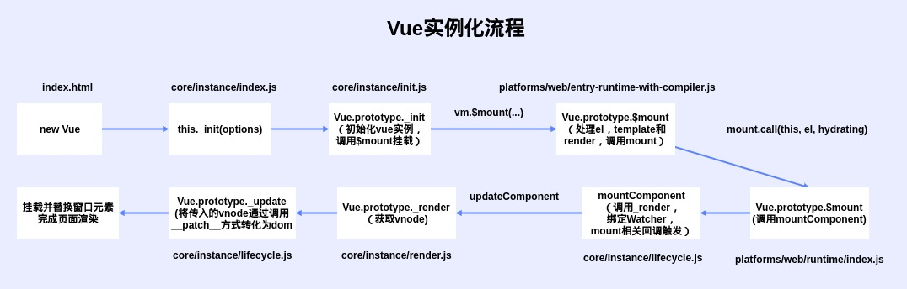

# 实例创建流程

## 入口

首先看源码项目的package.json

``` js
  "scripts": {
      "dev": "rollup -w -c scripts/config.js --environment TARGET:web-full-dev",
      // ...
  }
```

dev脚本中 -c scripts/config.js 指明配置文件所在

参数 TARGET:web-full-dev 指明输出文件配置项, line:123

``` js
  // Runtime+compiler development build (Browser)
  'web-full-dev': {
      entry: resolve('web/entry-runtime-with-compiler.js'), // 入口
      dest: resolve('dist/vue.js'), // 目标文件
      format: 'umd', // 输出规范
      env: 'development',
      alias: {
          he: './entity-decoder'
      },
      banner
  },
```

此时，找到入口在web/entry-runtime-with-compiler.js中

其中web为别名在vue/scripts/alias.js中定义

``` js
const path = require('path')

const resolve = p => path.resolve(__dirname, '../', p)

module.exports = {
    vue: resolve('src/platforms/web/entry-runtime-with-compiler'),
    compiler: resolve('src/compiler'),
    core: resolve('src/core'),
    shared: resolve('src/shared'),
    web: resolve('src/platforms/web'),
    weex: resolve('src/platforms/weex'),
    server: resolve('src/server'),
    sfc: resolve('src/sfc')
}
```

## 实例详解

### 实例流程



### 编译处理

#### platforms/web/entry-runtime-with-compiler.js

扩展默认mount方法，处理template或el选项

``` js
// vue实例来源于./runtime/index
import Vue from './runtime/index'

// ...
const mount = Vue.prototype.$mount
// 扩展mount方法，处理template或el选项
Vue.prototype.$mount = function(
    el ? : string | Element,
    hydrating ? : boolean
): Component {
    // 获取el
    el = el && query(el)
    // ...
    // 处理template或el转化出render
    const options = this.$options
    if (!options.render) {
        let template = options.template
        // 存在模板template执行编译
        if (template) {
            // 模板template处理
            // ...
        } else if (el) {
            // 若只有el则将el转化为template
            template = getOuterHTML(el)
        }
        if (template) {
            // 通过模板template获取渲染函数rendetr
            // ...
        }
    }
    return mount.call(this, el, hydrating)
}
// ...
```

从流程可以看出Vue.prototype.$mount是为了将template和el转化为render后并执行

所以在声明Vue实例时，熟悉优先级上render > template > el

#### platforms/web/runtime/index.js

用于安装web平台特有指令和组件，并定义替换指定元素的mount

``` js
// vue实例来源于core/index
import Vue from 'core/index'
// ...

// 安装特定于平台的实用工具
Vue.config.mustUseProp = mustUseProp
Vue.config.isReservedTag = isReservedTag
Vue.config.isReservedAttr = isReservedAttr
Vue.config.getTagNamespace = getTagNamespace
Vue.config.isUnknownElement = isUnknownElement

// 安装平台运行时指令和组件
extend(Vue.options.directives, platformDirectives)
extend(Vue.options.components, platformComponents)

// 安装平台补丁
// 补丁函数，执行patching算法进行更新，传入虚拟dom转为真实dom
Vue.prototype.__patch__ = inBrowser ? patch : noop

// $mount挂载Vue实例至宿主元素（获取DOM并替换宿主元素）
Vue.prototype.$mount = function(
    el ? : string | Element,
    hydrating ? : boolean
): Component {
    el = el && inBrowser ? query(el) : undefined
    // 初始化，并将首次渲染结果替换el指定的元素
    return mountComponent(this, el, hydrating)
}
```

### 全局API处理

#### core/index.js

初始化全局api

``` js
// vue实例来源于./instance/index
import Vue from './instance/index'
// 初始化全局API
import {
    initGlobalAPI
} from './global-api/index'
// ...

// 全局api
initGlobalAPI(Vue)

// 服务器和ssr相关处理
// ...

// 版本设置
Vue.version = '__VERSION__'

export default Vue
```

#### core/global-api/index.js

导出处理全局API方法

``` js
// ...

// 初始化全局API方法
export function initGlobalAPI(Vue: GlobalAPI) {
    // config设置
    // ...
    // 定义vue工具
    Vue.util = {
        warn,
        extend,
        mergeOptions,
        defineReactive
    }
    // 定义Vue方法API
    Vue.set = set
    Vue.delete = del
    Vue.nextTick = nextTick

    // ...
    initUse(Vue) // 实现Vue.use函数
    initMixin(Vue) // 实现Vue.mixin函数
    initExtend(Vue) // 实现Vue.extend函数
    initAssetRegisters(Vue) // 注册实现Vue.component/directive/filter

}
```

### Vue构造函数

#### core/instance/index.js

Vue构造函数

``` js
// 初始化方法导入
// ...

function Vue(options) {
    // 创建实例错误处理
    // ...
    // 构造函数仅执行了_init
    this._init(options)
}

initMixin(Vue) // 混入， 实现Vue增加init方法
stateMixin(Vue) // 状态相关混入状态相关api $data,$props,$set,$delete,$watch
eventsMixin(Vue) //事件相关api $on,$once,$off,$emit
lifecycleMixin(Vue) // 生命周期api _update,$forceUpdate,$destroy
renderMixin(Vue) // 渲染api _render,$nextTick

export default Vue
```

#### core/instance/init.js

创建组件实例, 初始化其数据、属性、事件等

``` js
/* @flow */
// ...
export function initMixin(Vue: Class < Component > ) {
    Vue.prototype._init = function(options ? : Object) {
        const vm: Component = this
        // 添加uid
        vm._uid = uid++
        // ...
        // 添加Vue判断标记
        vm._isVue = true
        if (options && options._isComponent) {
            //优化内部组件实例化
            //因为动态选项合并非常慢，而且没有
            //内部组件选项需要特殊处理。
            initInternalComponent(vm, options)
        } else {
            // 合并选项
            vm.$options = mergeOptions(
                resolveConstructorOptions(vm.constructor),
                options || {},
                vm
            )
        }
        // ...
        vm._self = vm
        initLifecycle(vm) // $parent,$root,$children,$refs
        initEvents(vm) // 添加监听，处理父组件传递的事件和回调
        initRender(vm) // $slots,$scopedSlots,_c,$createElement
        callHook(vm, 'beforeCreate') // 调用生命周期beforeCreate
        initInjections(vm) // 获取注入数据，data/prop之前处理注入
        initState(vm) // 初始化props,methods,data,computed,watch
        initProvide(vm) // 提供数据注入，data/prop之后处理注入
        callHook(vm, 'created')
        // ...
        // 执行元素挂载
        if (vm.$options.el) {
            vm.$mount(vm.$options.el)
        }
    }
}
// ...
```

#### core/instance/state.js

状态相关混入状态相关api
data, props, set, delete, watch初始化处理

#### core/instance/events.js

事件相关api
on, once, off, emit事件定义处理

#### core/instance/render.js

渲染组件，获取处理好的vdom

_render, nextTick

``` js
// ...

export function initRender(vm: Component) {
    vm._vnode = null // 子树的根
    vm._staticTrees = null // v-once缓存树
    const options = vm.$options
    const parentVnode = vm.$vnode = options._parentVnode // 父树中的占位符节点
    const renderContext = parentVnode && parentVnode.context
    vm.$slots = resolveSlots(options._renderChildren, renderContext)
    vm.$scopedSlots = emptyObject
    // 绑定createElement实例
    vm._c = (a, b, c, d) => createElement(vm, a, b, c, d, false)
    // 绑定$createElement规范用户使用
    vm.$createElement = (a, b, c, d) => createElement(vm, a, b, c, d, true)
    const parentData = parentVnode && parentVnode.data
    // ...
}

// ...

export function renderMixin(Vue: Class < Component > ) {
    // 安装运行时便利程序 
    installRenderHelpers(Vue.prototype)
    // 添加$nextTick
    Vue.prototype.$nextTick = function(fn: Function) {
        return nextTick(fn, this)
    }
    // 添加_render
    Vue.prototype._render = function(): VNode {
        const vm: Component = this
        const {
            render,
            _parentVnode
        } = vm.$options
        // ...
        //设置父vnode。这允许渲染功能具有占位符节点上的数据的访问权限。
        vm.$vnode = _parentVnode
        // render self
        let vnode
        try {
            // 执行render
            currentRenderingInstance = vm
            vnode = render.call(vm._renderProxy, vm.$createElement)
        } catch (e) {
            // ...
        } finally {
            currentRenderingInstance = null
        }
        // 如果返回的数组仅包含一个节点，则赋值该节点
        // ...
        // 如果渲染函数出错，则返回空的vnode
        // ...
        // 设置父节点
        vnode.parent = _parentVnode
        return vnode
    }
}
```

#### core/instance/lifecycle.js

生命周期钩子触发

执行挂载，初始化执行是dom创建

执行更新，将传入vdom转化为dom

``` js
// ...

// 执行挂载,获取vdom并转换为dom
export function mountComponent(
    vm: Component,
    el: ? Element,
    hydrating ? : boolean
): Component {
    vm.$el = el
    if (!vm.$options.render) {
        // 获取beforeMount
        // ...
    }
    // 触发beforeMount钩子
    callHook(vm, 'beforeMount')
    //...
    // Watcher添加beforeUpdate钩子
    new Watcher(vm, updateComponent, noop, {
        before() {
            if (vm._isMounted && !vm._isDestroyed) {
                callHook(vm, 'beforeUpdate')
            }
        }
    }, true /* isRenderWatcher */ )
    // ...

    //手动挂载的实例，调用挂载在self上
    //mount会在其插入的钩子中为渲染创建的子组件进行调用
    if (vm.$vnode == null) {
        vm._isMounted = true
        callHook(vm, 'mounted')
    }
    return vm
}

// 其它生命周期处理， 并在处理结束后调用callHook触发钩子
// ...

export function callHook(vm: Component, hook: string) {
    // ... 生命周期函数钩子调用
}
```
