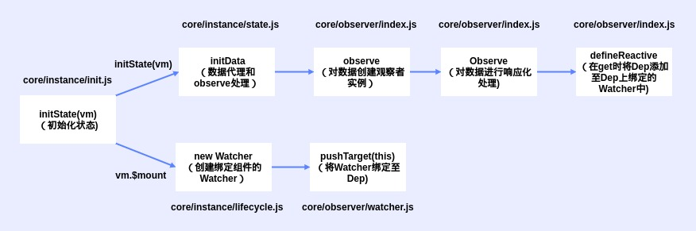

# 响应化流程

Vue一大特点是数据响应式, 数据的变化会作用于UI而不用进行DOM操作
原理上来讲, 是利用了JS语言特性Object.defineProperty(), 通过定义对象属性setter方法拦截对象属性变更, 从而将数值的变化转换为UI的变化。



## 数据初始化

Vue调用init初始化时, 会调用initState, 它会初始化data, props等

### core/instance/state.js

#### initState

初始化实例状态

``` js
export function initState(vm: Component) {
    vm._watchers = []
    const opts = vm.$options
    // 初始化props
    if (opts.props) initProps(vm, opts.props)
    // 初始化methods
    if (opts.methods) initMethods(vm, opts.methods)
    // 初始化data
    if (opts.data) {
        initData(vm)
    } else {
        observe(vm._data = {}, true /* asRootData */ )
    }
    // 初始化computed
    if (opts.computed) initComputed(vm, opts.computed)
    // 初始化wacth
    if (opts.watch && opts.watch !== nativeWatch) {
        initWatch(vm, opts.watch)
    }
}
```

#### initData

data数据初始化处理

``` js
function initData(vm: Component) {
    let data = vm.$options.data
    // 判定Data是函数还是对象
    data = vm._data = typeof data === 'function' ?
        getData(data, vm) :
        data || {}
    // ...
    // 实例上的代理数据 proxy
    const keys = Object.keys(data)
    const props = vm.$options.props
    const methods = vm.$options.methods
    let i = keys.length
    while (i--) {
        const key = keys[i]
        // 遍历key分别代理数据到vue实例上
        // ...
    }
    // 观察数据，执行响应化 observe
    observe(data, true /* asRootData */ )
}
```

## 数据响应化

### core/observer/index.js

#### observer

尝试为值创建观察者实例
如果成功观察到，则返回新的观察者
或现有的观察者（如果值已包含一个）

``` js
export function observe(value: any, asRootData: ? boolean): Observer | void {
    if (!isObject(value) || value instanceof VNode) {
        return
    }
    let ob: Observer | void
    if (hasOwn(value, '__ob__') && value.__ob__ instanceof Observer) {
        // 存在__ob__，则赋值返回
        ob = value.__ob__
    } else if (
        shouldObserve &&
        !isServerRendering() &&
        (Array.isArray(value) || isPlainObject(value)) &&
        Object.isExtensible(value) &&
        !value._isVue
    ) {
        // 不存在，则创建新Observer返回
        ob = new Observer(value)
    }
    // ...
    return ob
}
```

#### Observer

Observer构建时判断数据类型分别进行响应式处理

``` js
export class Observer {
    value: any;
    dep: Dep;
    vmCount: number; // number of vms that have this object as root $data

    constructor(value: any) {
        this.value = value
        this.dep = new Dep()
        this.vmCount = 0
        def(value, '__ob__', this)
        // 判断是否为数组
        if (Array.isArray(value)) {
            // 判断是否经过响应式处理的数组
            if (hasProto) {
                // 更换数据默认7个方法
                protoAugment(value, arrayMethods)
            } else {
                // 通过定义扩展目标对象或数组隐藏的属性
                copyAugment(value, arrayMethods, arrayKeys)
            }
            // 遍历子项重新调用observe判断
            this.observeArray(value)
        } else {
            // 遍历子项处理响应式
            this.walk(value)
        }
    }
    // 遍历处理子项
    walk(obj: Object) {
        const keys = Object.keys(obj)
        for (let i = 0; i < keys.length; i++) {
            defineReactive(obj, keys[i])
        }
    }
    // 处理列表
    observeArray(items: Array < any > ) {
        for (let i = 0, l = items.length; i < l; i++) {
            observe(items[i])
        }
    }
}
```

其中数组的响应化是对Array的prototype替换为arrayMethods，重写了七个方法

### defineReactive

defineReactive定义对象属性的getter/setter, getter负责添加依赖, setter负责通知更新

``` js
export function defineReactive(
    obj: Object,
    key: string,
    val: any,
    customSetter ? : ? Function,
    shallow ? : boolean
) {
    const dep = new Dep()
    // ...

    // 预定义的getter/setter
    const getter = property && property.get
    const setter = property && property.set
    if ((!getter || setter) && arguments.length === 2) {
        val = obj[key]
    }

    // 获取子的ob， 只要是对象，observe(val)都会返回ob
    let childOb = !shallow && observe(val)
    Object.defineProperty(obj, key, {
        enumerable: true,
        configurable: true,
        get: function reactiveGetter() {
            // get取值处理
            const value = getter ? getter.call(obj) : val
            // Dep添加
            if (Dep.target) {
                // 添加target
                dep.depend()
                // 存在子项观察者
                if (childOb) {
                    // 子项添加target
                    childOb.dep.depend()
                    if (Array.isArray(value)) {
                        dependArray(value)
                    }
                }
            }
            return value
        },
        set: function reactiveSetter(newVal) {
            // 运行原始的set赋值处理
            // ...
            childOb = !shallow && observe(newVal)
            // 通知变更
            dep.notify()
        }
    })
}
```

### core/observer/dep.js

#### Dep

Dep负责管理一组Watcher, 包括watcher实例的增删及通知更新

``` js
export default class Dep {
    static target: ? Watcher;
    id: number;
    subs: Array < Watcher > ;

    constructor() {
        this.id = uid++
        this.subs = []
    }

    addSub(sub: Watcher) {
        // 添加Watcher
        this.subs.push(sub)
    }

    removeSub(sub: Watcher) {
        // 去除Watcher
        remove(this.subs, sub)
    }

    depend() {
        // Dep添加到Watcher中
        if (Dep.target) {
            Dep.target.addDep(this)
        }
    }

    notify() {
        // ...
        // 通知Watcher更新
        for (let i = 0, l = subs.length; i < l; i++) {
            subs[i].update()
        }
    }
}
```

### Watcher

Watcher解析一个表达式并收集依赖, 当数值变化时触发回调函数, 常用于$watch API和指令中

vue2.0中，wachter和dep由多对一转变成多对多

mountComponent中新建Watcher

``` js
export default class Watcher {
    constructor() {}
    get() {
        // 给当前Dep添加target
        pushTarget(this)
        // ...
    }
    // 处理newDepIds和newDeps添加
    // 向Dep中添加Watcher
    addDep(dep: Dep) {}
    update() {}
}
```

### 总结

#### 数量判断

1. data中存在几个key则有几个Dep
2. 一个数据中只有一个Watcher
3. Observer则是一个对象有一个，包括data

#### Vue2.0缺点

1. 递归遍历处理，影响性能
2. 对象和数组的api不统一

于是vue3.0中使用了proxy用于替代了Object.defineProperty

## 响应式处理API

### $set

插入新响应式数据

``` js
export function set(target: Array < any > | Object, key: any, val: any): any {
    // ...
    // 数组处理
    if (Array.isArray(target) && isValidArrayIndex(key)) {
        // 扩容数组
        target.length = Math.max(target.length, key)
        // 调用splice添加数据并触发更新
        target.splice(key, 1, val)
        return val
    }
    // 处理已存在key
    if (key in target && !(key in Object.prototype)) {
        // 直接更改值返回
        target[key] = val
        return val
    }
    // const ob = (target: any).__ob__
    // 判断是否是__ob__
    if (!ob) {
        // target非响应式，直接赋值
        target[key] = val
        return val
    }
    // target响应式
    // 定义新响应式对象
    // 通知更新
    defineReactive(ob.value, key, val)
    ob.dep.notify()
    return val
}
```

### $delete

删除数据

``` js
export function del(target: Array < any > | Object, key: any) {
    // ...
    // 若是数组直接调用splice更新
    if (Array.isArray(target) && isValidArrayIndex(key)) {
        target.splice(key, 1)
        return
    }
    // const ob = (target: any).__ob__
    // ...
    // 删除对应值
    if (!hasOwn(target, key)) {
        return
    }
    delete target[key]
    if (!ob) {
        // target非响应式，直接返回
        return
    }
    // target响应式
    // 通知更新
    ob.dep.notify()
}
```

### $watch

定义数据变动监听

``` js
  Vue.prototype.$watch = function(
      expOrFn: string | Function,
      cb: any,
      options ? : Object
  ): Function {
      const vm: Component = this
      if (isPlainObject(cb)) {
          // 如果cb是对象，调用createWatcher创建
          return createWatcher(vm, expOrFn, cb, options)
      }
      // 若cb是函数
      options = options || {}
      // 设定为用户定义监听
      options.user = true
      // 新建Watcher
      const watcher = new Watcher(vm, expOrFn, cb, options)
      if (options.immediate) {
          // options.immediate存在，立即执行一次
          //...
      }
      // 返回取消watch监听函数
      return function unwatchFn() {
          watcher.teardown()
      }
  }
```
