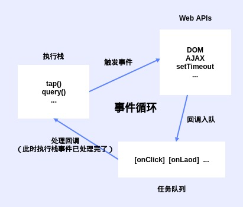
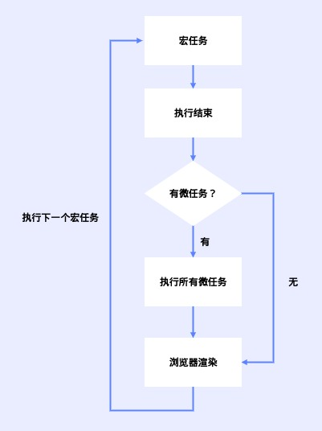

# 异步式更新

Vue采用的是一个批量的，异步的更新策略

## 概念

### 简述

#### 渲染进程

浏览器中与前端相关的进程

1. GUI渲染进程 - 解析DOM和CSS的并绘制界面的
2. JS引擎线程 - 执行JS的线程，注意与GUI渲染进程互斥，过长代码执行时间会导致页面卡顿
3. 事件触发线程 - 管理异步或定时事件循环的线程，触发的事件会在队列尾部等待JS引擎线程处理
4. 定时触发器线程 - setTimeout，setInteval所在的线程
5. 异步http请求线程 - XMLHttpRequest在连接后是通过浏览器新开一个线程请求，并在接收回调后放入事件队列中，等待JS引擎线程执行

#### 事件循环

浏览器为了协调事件处理，脚本执行，网络请求和渲染等任务而制定的一套工作机制

##### 执行过程



JS事件分为同步任务和异步任务
同步任务会在主线程运行，形成一个执行栈
当异步任务执行完成后便会在任务队列中放置一个事件，等待主线程执行完任务后再处理

#### 宏任务与微任务

##### 宏任务

代表一个个离散的、独立工作单元
浏览器完成一个宏任务，在下一个宏任务执行开始前，会对页面进行重新渲染

1. 创建主文档对象
2. 解析HTML
3. 执行主线JS代码
4. 各种事件如页面加载、输入、网络事件和定时器等

setTimeout，setInteval，xhr ...

##### 微任务

微任务是更小的任务，是在当前宏任务执行结束后立即执行的任务
宏任务执行结束后，如果存在微任务，浏览器会清空微任务之后再重新渲染
微任务的例子有 promise 回调函数、DOM发生变化等
Promise，mutaition observe ...

##### 执行顺序



案例

``` js
console.log('script start');

setTimeout(function() {
    console.log('setTimeout');
}, 0);

Promise.resolve()
    .then(function() {
        console.log('promise1');
    })
    .then(function() {
        console.log('promise2');
    });

console.log('script end');

// 打印顺序
// script start
// script end
// promise1
// promise2
// setTimeout
```

### 了解更多

[从浏览器多进程到JS单线程，JS运行机制最全面的一次梳理](https://segmentfault.com/a/1190000012925872?utm_source=tag-newest)
[Tasks, microtasks, queues and schedules](https://jakearchibald.com/2015/tasks-microtasks-queues-and-schedules/?utm_source=html5weekly)

## Vue的异步更新

Vue主要逻辑是将更新事件队列去重的存放于微任务中，等到宏任务执行结束后统一执行微任务并更新界面

### 具体实现

#### 异步

数据变化，触发Watcher，Watcher的update将开启一个队列，并缓冲在同一事件循环中发生的所有数据变更

#### 批量和去重

如果同一个 watcher 被多次触发，只会被推入到队列中一次
在下一个的事件循环“tick”中，统一触发watcher更新界面

#### 异步策略

Vue 在内部对异步队列尝试使用原生的Promise.then、MutationObserver和setImmediate微任务执行
如果执行环境不支持，则会采用宏任务setTimeout(fn, 0)代替

### 实现流程

#### core/observer/index.js

数据更新触发set中的dep.notify

``` js
// defineReactive
set: function reactiveSetter(newVal) {
    // ...
    // 通知Dep中的Watcher触发update方法
    dep.notify()
}
```

#### core/observer/watcher.js

调用queueWatcher执行入队操作

``` js
  update() {
      /* istanbul ignore else */
      if (this.lazy) {
          this.dirty = true
      } else if (this.sync) {
          this.run()
      } else {
          queueWatcher(this)
      }
  }
```

#### core/observer/scheduler.js

``` js
export function queueWatcher(watcher: Watcher) {
    const id = watcher.id
    // Watcher入队并做i去重判断
    if (has[id] == null) {
        has[id] = true
        if (!flushing) {
            queue.push(watcher)
        } else {
            let i = queue.length - 1
            while (i > index && queue[i].id > watcher.id) {
                i--
            }
            queue.splice(i + 1, 0, watcher)
        }
        // 排队flush
        if (!waiting) {
            waiting = true
            if (process.env.NODE_ENV !== 'production' && !config.async) {
                flushSchedulerQueue()
                return
            }
            nextTick(flushSchedulerQueue)
        }
    }
}
```

#### core/util/next-tick.js

##### nextTick

收集回调，按照特定

``` js
export function nextTick(cb ? : Function, ctx ? : Object) {
    let _resolve
    // 收集回调
    callbacks.push(() => {
        if (cb) {
            try {
                cb.call(ctx)
            } catch (e) {
                handleError(e, ctx, 'nextTick')
            }
        } else if (_resolve) {
            _resolve(ctx)
        }
    })
    if (!pending) {
        pending = true
        // 将flushCallbacks放置微任务中
        timerFunc()
    }
    // ...
}
```

##### flushCallbacks

便利callbacks触发事件回调

##### timerFunc

将队列放置于Promise等微任务中

### 案例

``` js
// mounted中添加
setInterval(() => {
    // 多次改值，queueWatcher只会入队一个
    this.foo = Math.random()
    this.foo = Math.random()
    this.foo = Math.random()
    // 此时内容不变
    console.log(p1.innerHTML)
    this.$nextTick(() => {
        // 界面更新后的最新值
        console.log(p1.innerHTML)
    })
}, 3000);;

// foo值改变，导致update触发三次，但是run只执行一次
// $nextTick中打印的才是最新值
```
