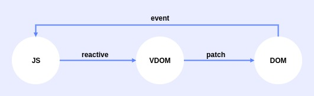

# 虚拟DOM

## 概念

DOM树的JS的抽象表示, 可以应用各种数据变化，同时映射到DOM上



### 优点

1. 轻量，快速

    可以通过对比新旧VDOM得出最小化修改DOM方案

2. 跨平台

    可以通过改变虚拟DOM的转化的方式实现不同平台的展示（uniapp实现原理）

3. 兼容性

    可以加入兼容性代码实现操作的兼容

### Vue2.0中VDOM选择原因

1.0中，由于采用了细粒度的变化方法，即为每一个动态数据都绑定一个watcher用于监听变化，此时不需要vnode作处理的中间过程， 但是这样会造成开销大，于是2.0中更改为中等粒度的监听方式

2.0中采用中等粒度的监听方式，watcher只与组件绑定，此时需要VDOM作为中间件，比较前后差异从而最小化更新界面

## 流程

### mountComponent()

core/instance/lifecycle.js
初始化调用mountComponent生成updateComponent和watcher，watcher.run()调用updateComponent函数渲染

``` js
export function mountComponent(
    vm: Component,
    el: ? Element,
    hydrating ? : boolean
): Component {
    // ...
    callHook(vm, 'beforeMount')
    // 获取updateComponent
    let updateComponent
    // ...
    updateComponent = () => {
        // 调用_render()渲染vnode
        vm._update(vm._render(), hydrating)
    }
    // ...

    // 创建Watcher，并在其中调用updateComponent
    // ...
    if (vm.$vnode == null) {
        vm._isMounted = true
        callHook(vm, 'mounted')
    }
    return vm
}
```

### _render()

core/instance/render.js
调用实例vm.$options中的render渲染生产虚拟DOM

``` js
  Vue.prototype._render = function(): VNode {
      const vm: Component = this
      const {
          render,
          _parentVnode
      } = vm.$options
      // ...
      // 自我渲染
      let vnode
      try {
          // render调用渲染函数渲染vnode
          currentRenderingInstance = vm
          vnode = render.call(vm._renderProxy, vm.$createElement)
      } catch (e) {
          // 错误处理
          // ...
      } finally {
          currentRenderingInstance = null
      }
      // 如果返回的数组仅包含一个节点，则允许它
      if (Array.isArray(vnode) && vnode.length === 1) {
          vnode = vnode[0]
      }
      if (!(vnode instanceof VNode)) {
          // 函数出错返回空节点
          // ...
      }
      // 设置父节点
      vnode.parent = _parentVnode
      return vnode
  }
```

### _update()

core/instance/lifecycle.js
调用设置好的patch函数，渲染vdom至真实dom

``` js
export function lifecycleMixin(Vue: Class < Component > ) {
    Vue.prototype._update = function(vnode: VNode, hydrating ? : boolean) {
        const vm: Component = this
        const prevEl = vm.$el
        const prevVnode = vm._vnode
        const restoreActiveInstance = setActiveInstance(vm)
        vm._vnode = vnode
        //Vue.prototype .__ patch__实现的不同也会造成页面渲染的方式不同，达到多平台目的
        if (!prevVnode) {
            // 首次渲染
            vm.$el = vm.__patch__(vm.$el, vnode, hydrating, false)
        } else {
            // 更新渲染
            vm.$el = vm.__patch__(prevVnode, vnode)
        }
        // 此时渲染已更新到界面
        // ...
    }
    // $forceUpdate 和 $destroy
    // ...
}
```

### __patch__

core/vdom/patch.js
处理新节点生成和旧节点的删除或是对现有节点修补，同时更新界面

## patch

### 来源

#### platforms/web/runtime/index.js

``` js
import {
    patch
} from './patch'
// ...
// 调用$mount之前
Vue.prototype.__patch__ = inBrowser ? patch : noop
```

#### platforms/web/runtime/patch.js

``` js
// 定义各种原生控制dom方式
import * as nodeOps from 'web/runtime/node-ops'
// 定义属性更新实现
import platformModules from 'web/runtime/modules/index'
export const patch: Function = createPatchFunction({
    nodeOps,
})
```

### 实现

#### patch() core/vdom/patch.js

首先比较新旧虚拟节点间差异，此时有两种情况

1. sameVnode(oldVnode, vnode)同时并非真实节点，此时调用diff算法进行节点更新
2. 添加新节点，删除旧节点

``` js
return function patch(oldVnode, vnode, hydrating, removeOnly) {
    if (isUndef(vnode)) {
        if (isDef(oldVnode)) invokeDestroyHook(oldVnode)
        return
    }

    let isInitialPatch = false
    const insertedVnodeQueue = []

    if (isUndef(oldVnode)) {
        // 空挂载（例如组件）
        isInitialPatch = true
        createElm(vnode, insertedVnodeQueue)
    } else {
        const isRealElement = isDef(oldVnode.nodeType)
        // 如果并非真实元素并且存在相同节点，调用patchVnode修补现有节点
        if (!isRealElement && sameVnode(oldVnode, vnode)) {
            // 修补现有的根节点, patchVnode
            patchVnode(oldVnode, vnode, insertedVnodeQueue, null, null, removeOnly)
        } else {
            // 真实元素处理
            // ...

            // 替换现有元素
            const oldElm = oldVnode.elm
            const parentElm = nodeOps.parentNode(oldElm)

            // 创建新节点
            createElm(
                vnode,
                insertedVnodeQueue,
                oldElm._leaveCb ? null : parentElm,
                nodeOps.nextSibling(oldElm)
            )

            // 递归更新父占位符节点元素 
            // ...

            // 删除旧节点
            if (isDef(parentElm)) {
                removeVnodes([oldVnode], 0, 0)
            } else if (isDef(oldVnode.tag)) {
                invokeDestroyHook(oldVnode)
            }
        }
    }

    invokeInsertHook(vnode, insertedVnodeQueue, isInitialPatch)
    return vnode.elm
}
```

#### patchVnode() core/vdom/patch.js

修补节点，有三个操作

1. 属性更新
2. 子节点更新
3. 文本更新

执行修补则是有如下规则

1. 新旧双方都有子节点 ===> 调用updateChildren，使用diff算法比较更新
2. 只有新节点有子节点 ===> 清空老节点文本，新增子节点
3. 只有旧节点有子节点 ===> 移除所有子节点
4. 新旧都双方无子节点 ===> 文本替换

``` js
function patchVnode(
    oldVnode,
    vnode,
    insertedVnodeQueue,
    ownerArray,
    index,
    removeOnly
) {
    // ...
    const oldCh = oldVnode.children
    const ch = vnode.children
    if (isDef(data) && isPatchable(vnode)) {
        for (i = 0; i < cbs.update.length; ++i) cbs.update[i](oldVnode, vnode)
        if (isDef(i = data.hook) && isDef(i = i.update)) i(oldVnode, vnode)
    }
    if (isUndef(vnode.text)) {
        if (isDef(oldCh) && isDef(ch)) {
            // 新旧双方都有子节点
            if (oldCh !== ch) updateChildren(elm, oldCh, ch, insertedVnodeQueue, removeOnly)
        } else if (isDef(ch)) {
            // 只有新节点存在子节点
            // ...
            if (isDef(oldVnode.text)) nodeOps.setTextContent(elm, '')
            addVnodes(elm, null, ch, 0, ch.length - 1, insertedVnodeQueue)
        } else if (isDef(oldCh)) {
            // 只有旧节点存在子节点
            removeVnodes(oldCh, 0, oldCh.length - 1)
        } else if (isDef(oldVnode.text)) {
            // 旧节点存在文本节点
            nodeOps.setTextContent(elm, '')
        }
    } else if (oldVnode.text !== vnode.text) {
        // 新旧都双方无子节点，同时文本节点不为空
        nodeOps.setTextContent(elm, vnode.text)
    }
    //...
}
```

#### updateChildren() core/vdom/patch.js

关于diff算法，推荐直接去看B站
[【李发亮】图解 Vue.js Virtual DOM 的 Diff 算法核心](https://www.bilibili.com/video/BV1b5411V7i3?from=search&seid=10704456676314298716)

``` js
  function updateChildren(parentElm, oldCh, newCh, insertedVnodeQueue, removeOnly) {
      // ...
      // diff算法处理节点比较
      while (oldStartIdx <= oldEndIdx && newStartIdx <= newEndIdx) {
          if (isUndef(oldStartVnode)) {
              oldStartVnode = oldCh[++oldStartIdx] // Vnode has been moved left
          } else if (isUndef(oldEndVnode)) {
              oldEndVnode = oldCh[--oldEndIdx]
          } else if (sameVnode(oldStartVnode, newStartVnode)) {
              patchVnode(oldStartVnode, newStartVnode, insertedVnodeQueue, newCh, newStartIdx)
              oldStartVnode = oldCh[++oldStartIdx]
              newStartVnode = newCh[++newStartIdx]
          } else if (sameVnode(oldEndVnode, newEndVnode)) {
              patchVnode(oldEndVnode, newEndVnode, insertedVnodeQueue, newCh, newEndIdx)
              oldEndVnode = oldCh[--oldEndIdx]
              newEndVnode = newCh[--newEndIdx]
          } else if (sameVnode(oldStartVnode, newEndVnode)) { // Vnode moved right
              patchVnode(oldStartVnode, newEndVnode, insertedVnodeQueue, newCh, newEndIdx)
              canMove && nodeOps.insertBefore(parentElm, oldStartVnode.elm, nodeOps.nextSibling(oldEndVnode.elm))
              oldStartVnode = oldCh[++oldStartIdx]
              newEndVnode = newCh[--newEndIdx]
          } else if (sameVnode(oldEndVnode, newStartVnode)) { // Vnode moved left
              patchVnode(oldEndVnode, newStartVnode, insertedVnodeQueue, newCh, newStartIdx)
              canMove && nodeOps.insertBefore(parentElm, oldEndVnode.elm, oldStartVnode.elm)
              oldEndVnode = oldCh[--oldEndIdx]
              newStartVnode = newCh[++newStartIdx]
          } else {
              if (isUndef(oldKeyToIdx)) oldKeyToIdx = createKeyToOldIdx(oldCh, oldStartIdx, oldEndIdx)
              idxInOld = isDef(newStartVnode.key) ?
                  oldKeyToIdx[newStartVnode.key] :
                  findIdxInOld(newStartVnode, oldCh, oldStartIdx, oldEndIdx)
              if (isUndef(idxInOld)) { // New element
                  createElm(newStartVnode, insertedVnodeQueue, parentElm, oldStartVnode.elm, false, newCh, newStartIdx)
              } else {
                  vnodeToMove = oldCh[idxInOld]
                  if (sameVnode(vnodeToMove, newStartVnode)) {
                      patchVnode(vnodeToMove, newStartVnode, insertedVnodeQueue, newCh, newStartIdx)
                      oldCh[idxInOld] = undefined
                      canMove && nodeOps.insertBefore(parentElm, vnodeToMove.elm, oldStartVnode.elm)
                  } else {
                      // same key but different element. treat as new element
                      createElm(newStartVnode, insertedVnodeQueue, parentElm, oldStartVnode.elm, false, newCh, newStartIdx)
                  }
              }
              newStartVnode = newCh[++newStartIdx]
          }
      }
      if (oldStartIdx > oldEndIdx) {
          refElm = isUndef(newCh[newEndIdx + 1]) ? null : newCh[newEndIdx + 1].elm
          addVnodes(parentElm, refElm, newCh, newStartIdx, newEndIdx, insertedVnodeQueue)
      } else if (newStartIdx > newEndIdx) {
          removeVnodes(oldCh, oldStartIdx, oldEndIdx)
      }
  }
```
