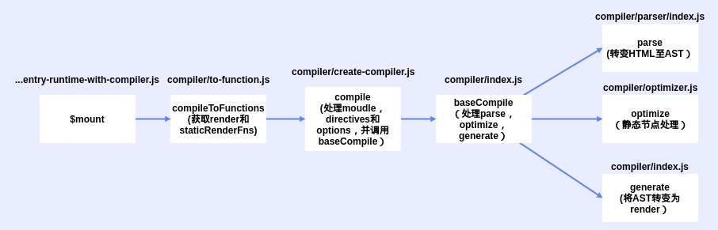

# 模板编译

目的是将template转换成render

## 必要性

直接手写render不现实，使用模板编译是为了更快速的开发
同时项目编译时便会将template转化为render，项目加载速度与render几乎无差别（这也是运行环境下render中不能使用template原因)

## 流程



### 解析-parse

将模板转化为AST，基于AST进行模版的代码生成和优化

解析器内部分了HTML解析器、文本解析器和过滤器解析器，最主要是HTML解析器

``` js
//// platforms/web/entry-runtime-with-compiler.js
// 处理完template和el，调用compileToFunctions获取render
if (template) {
    // ...
    // 得到渲染函数
    const {
        render,
        staticRenderFns
    } = compileToFunctions(template, {
        outputSourceRange: process.env.NODE_ENV !== 'production',
        shouldDecodeNewlines,
        shouldDecodeNewlinesForHref,
        delimiters: options.delimiters,
        comments: options.comments
    }, this)
    // ...
}

//// compiler/to-function.js
// 调用compile获取编译结果
const compiled = compile(template, options)

/// compiler/create-compiler.js
// baseCompile中调用了parse
const compiled = baseCompile(template.trim(), finalOptions)
```

### 优化-optimize

将没有响应式数据的节点（永远不会变动的节点）设定为静态节点

优势在于静态节点的子树不会重新渲染，节省资源，提升速度

标记结束后ast的节点上会的static熟悉设定为true

### 生成-generate

处理AST，将其转变为render函数字符串

### 处理代码

compiler/index.js

``` js
import {
    parse
} from './parser/index'
import {
    optimize
} from './optimizer'
import {
    generate
} from './codegen/index'
import {
    createCompilerCreator
} from './create-compiler'

export const createCompiler = createCompilerCreator(function baseCompile(
    template: string,
    options: CompilerOptions
): CompiledResult {
    // parse获取AST
    const ast = parse(template.trim(), options)
    // 优化，静态节点标记
    if (options.optimize !== false) {
        optimize(ast, options)
    }
    // 生成render函数字符串
    const code = generate(ast, options)
    return {
        ast,
        render: code.render,
        staticRenderFns: code.staticRenderFns
    }
})
```

## v-if与v-for

### v-if

#### v-if解析

parser/index.js
processIf用于处理v-if解析

#### v-if生成

src\compiler\codegen\index.js
genIfConditions等用于生成条件语句相关代码

### v-for

#### v-for解析

parser/index.js
processFor用于处理v-for解析

#### v-for生成

src\compiler\codegen\index.js
genFor用于生成相应代码

### 注意

v-if与v-for只可以在编译器时使用，render想要使用则用if与for替换
