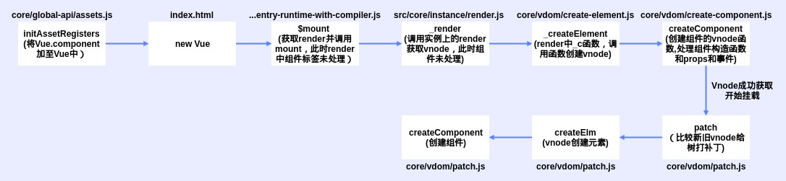

# 组件化机制

## 组件声明

src/core/global-api/assets.js

Vue.component()使用initAssetRegisters声明组件

组件注册使用extend方法将配置转换为构造函数并添加到components选项

``` js
export function initAssetRegisters(Vue: GlobalAPI) {
    // ASSET_TYPES = [component, directive, filter]
    // 声明Vue的component, directive, filter方法实现
    ASSET_TYPES.forEach(type => {
        Vue[type] = function(
            id: string,
            definition: Function | Object
        ): Function | Object | void {
            if (!definition) {
                return this.options[type + 's'][id]
            } else {
                // 生产环境校验组件名称
                // ...

                // 组件处理
                if (type === 'component' && isPlainObject(definition)) {
                    definition.name = definition.name || id
                    definition = this.options._base.extend(definition)
                }
                // 指令处理
                if (type === 'directive' && typeof definition === 'function') {
                    definition = {
                        bind: definition,
                        update: definition
                    }
                }
                this.options[type + 's'][id] = definition
                return definition
            }
        }
    })
}
```

## 处理渲染结果函数

这里可以看到组件标签并未处理

``` js
with(this) {
    return _c('div', {
        attrs: {
            "id": "app"
        }
    }, [_c('div', {
        attrs: {
            "id": "p1"
        }
    }, [_v(_s(foo))]), _v(" "), _m(0), _v(" "), (true) ? _c('div', {
        attrs: {
            "id": "p4"
        }
    }, [_c('div', [_v("if")])]) : _e(), _v(" "), _l((3), function(i) {
        return _c('div', {
            attrs: {
                "id": "p4"
            }
        }, [_c('div', [_v("for " + _s(i))])])
    }), _v(" "), _c('test')], 2)
}
```

## 处理流程



``` js
 function createComponent(vnode, insertedVnodeQueue, parentElm, refElm) {
     let i = vnode.data
     if (isDef(i)) {
         const isReactivated = isDef(vnode.componentInstance) && i.keepAlive
         // 组件实力创建挂载
         if (isDef(i = i.hook) && isDef(i = i.init)) {
             i(vnode, false)
         }
         if (isDef(vnode.componentInstance)) {
             // 元素引用制定vnode.elm，元素属性创建
             initComponent(vnode, insertedVnodeQueue)
             // 插入到父元素
             insert(parentElm, vnode.elm, refElm)
             if (isTrue(isReactivated)) {
                 reactivateComponent(vnode, insertedVnodeQueue, parentElm, refElm)
             }
             return true
         }
     }
 }
```
