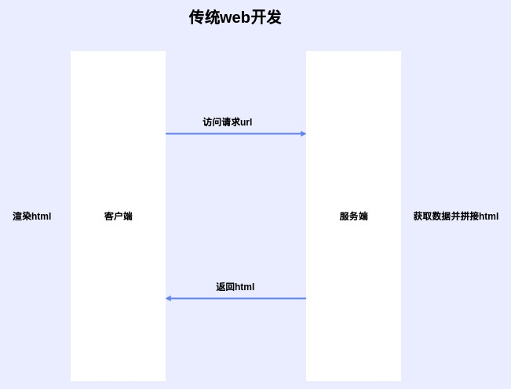
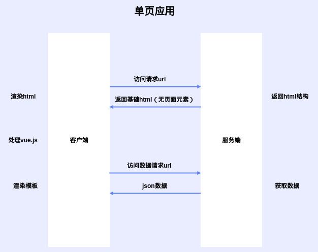
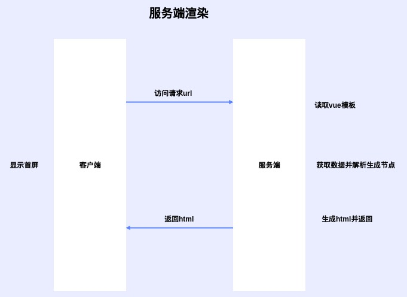

# 服务端渲染

直接在服务器上进行HTML渲染

## 页面渲染比较

### 传统web开发

网页内容全部在服务器中渲染完成，然后直接发送给浏览器

### 单页应用SPA

服务端不进行页面html生成，同时将处理好的js发送至客户端交由vue进行处理和页面渲染

### 服务端渲染SSR

后端渲染出首屏页面DOM，客户端获取首屏和SPA结构，并在页面渲染时挂载js，当页面激活后依然按照SPA方式进行运行

## 总结

### 优点

1. SEO
2. 首屏时间减少

### 缺点

1. 生命周期不可用， 一些第三方库不可用
2. 服务器负载大（尝试负载均衡）

### SPA修改至SSR

1. 只有部分页面需要渲染可以考虑vue-ssr
2. 使用服务器爬虫puppeteer
3. 使用nuxt.js重构
