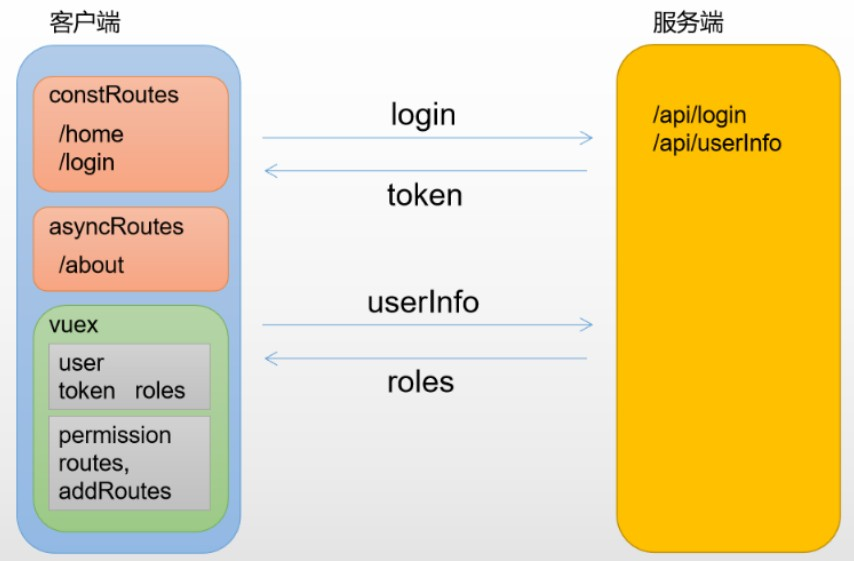

# 权限控制

路由分为两种：constantRoutes 和 asyncRoutes

前者是默认路由可直接访问，后者中定义的路由需要先登录，获取角色并过滤后动态加入到Router中



## 用户状态维护

store/modules/user.js

维护用户数据、处理用户登录等

## permission模块

store/modules/permission.js

维护路由信息, 实现动态路由生成逻辑

## 路由处理

路由处理可以分为本地守卫处理和异步获取路由处理i

### 路由守卫处理跳转

获取用户角色，判断用户是否拥有访问权限

``` js
// permission.js
import store from './store'
router.beforeEach(async (to, from, next) => {
    // ...
    if (hasToken) {
        // 已登陆
        if (to.path === '/login') {
            // 跳转至登录页
        } else {
            // 若用户角色已附加则说明权限以判定,动态路由已添加
            const hasRoles = store.getters.roles && store.getters.roles.length > 0;
            if (hasRoles) {
                // 说明用户已获取过角色信息,放行
                next()
            } else {
                try {
                    // 先请求获取用户信息
                    const {
                        roles
                    } = await store.dispatch('user/getInfo')

                    // 根据当前用户角色过滤出可访问路由
                    const accessRoutes = await store.dispatch('permission/generateRoutes', roles)
                    // 添加至路由器
                    router.addRoutes(accessRoutes)
                    // 继续路由切换,确保addRoutes完成
                    next({
                        ...to,
                        replace: true
                    })
                } catch (error) {
                    // 出错需重置令牌并重新登录(令牌过期、网络错误等原因)
                    await store.dispatch('user/resetToken')
                    next(`/login?redirect=${to.path}`)
                    alert(error || '未知错误')
                }
            }
        }
    } else {
        // 未登录...
    }
})
```

### 异步获取路由表

可以当用户登录后向后端请求可访问的路由表

这里多了一步将后端返回路由表中组件名称和本地的组件映射步骤

``` js
// 前端组件名和组件映射表
const map = {
    //xx: require('@/views/xx.vue').default
    // 同步的方式
    xx: () => import('@/views/xx.vue')
    // 异步的方式
}
// 服务端返回的asyncRoutes
const asyncRoutes = [{
    path: '/xx',
    component: 'xx'
}]
// 遍历asyncRoutes,将component替换为map[component]
function mapComponent(asyncRoutes) {
    asyncRoutes.forEach(route => {
        route.component = map[route.component];
        if (route.children) {
            route.children.map(child => mapComponent(child))
        }
    })
}
mapComponent(asyncRoutes)
```

## 按钮权限

页面中某些按钮，链接有时候需要更细粒度权限控制，这时候可以封装一个指令v-permission

该指令只能删除挂载指令的元素, 对于那些额外生成的和指令无关的元素无能为力

此时只能使用v-if来实现

``` HTML
<template>
    <el-tab-pane v-if="checkPermission(['admin'])">
</template>
<script>
    export default {
        methods: {
            checkPermission(permissionRoles) {
                return roles.some((role) => {
                    return permissionRoles.includes(role);
                });
            },
        },
    };
</script>
```
